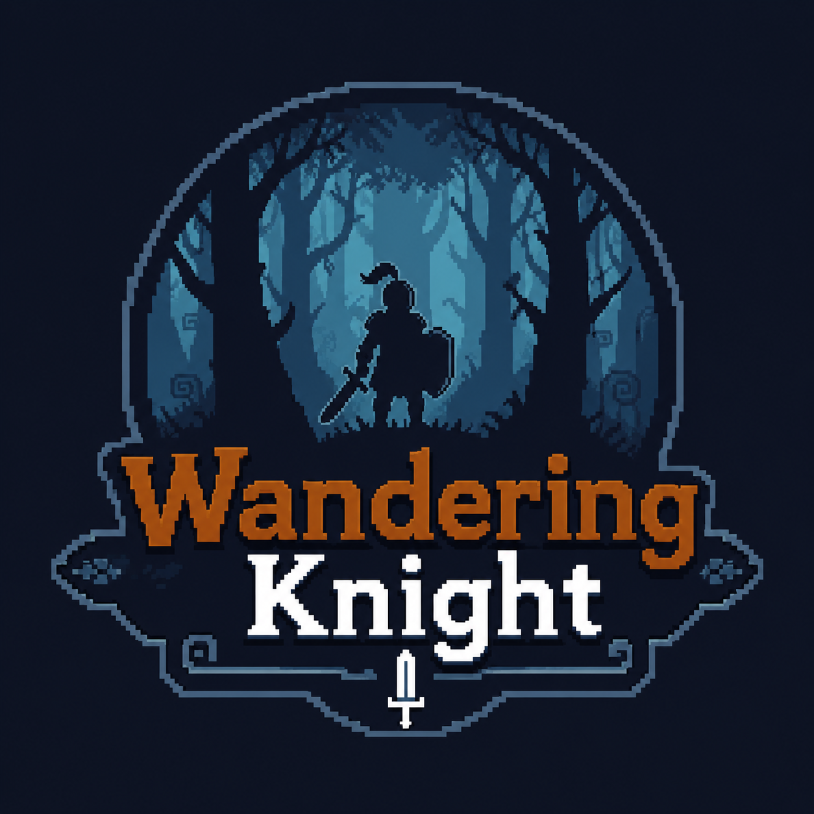

<p align="center">
  
</p>

<h1 align="center">Wandering Knight</h1>

<p align="center">
  Một tựa game 2D Action-Platformer (Side-scrolling) phiêu lưu hành động kịch tính được phát triển bằng <b>C#</b> và <b>MonoGame</b>.
</p>

<p align="center">
  
  
  
  
</p>

---

## 🎮 Giới thiệu dự án

**Wandering Knight** là câu chuyện kể về hành trình phiêu lưu của một hiệp sĩ lang thang vượt qua các vùng đất nguy hiểm đầy rẫy cạm bẫy, đối đầu với băng cướp (Bandits) hung dữ và chiến đấu với Boss hộ vệ mạnh mẽ ở màn cuối (Level 3). 

Dự án được thiết kế theo cấu trúc tách biệt rõ ràng giữa **Core Engine Library** và **Game Logic**, mang lại tính mô-đun cao và khả năng tái sử dụng mã nguồn tốt cho các dự án game 2D khác.

### 🌟 Vòng lặp Gameplay chính (Core Loop)
```
Khám phá Màn chơi ➔ Tiêu diệt kẻ địch ➔ Nhặt Tiền & Bình máu ➔ Mở cổng (Gate) ➔ Qua màn tiếp theo
                                                                           ➔ Level 3: Đấu Boss & Victory!
```

---

## ✨ Tính năng nổi bật

- **Hệ thống Di chuyển (Movement)**: Chạy, Nhảy (Jump), Rơi tự do (Fall) có gia tốc trọng trường và Lướt nhanh (Dash) né đòn.
- **Hệ thống Chiến đấu (Combat)**: Tấn công cận chiến (Melee attack) với cơ chế va chạm hitbox chuẩn xác và hệ thống trạng thái bất tử tạm thời (I-Frames) khi bị trúng đòn hoặc lướt.
- **Trí tuệ nhân tạo (AI)**:
  - **Kẻ địch thường (Bandits)**: Tự động tuần tra trong phạm vi quy định (Patrol), phát hiện người chơi khi ở gần (Chase) và tấn công khi tiếp cận (Attack).
  - **Boss**: Di chuyển linh hoạt, tự động kích hoạt trạng thái rút lui/né tránh (Flee state) khi lượng máu thấp để bảo vệ bản thân, kết hợp tấn công dồn dập.
- **Cuộn phông nền Parallax**: Background cuộn song song 7 lớp chiều sâu khác biệt, tạo hiệu ứng không gian 2D sinh động, nghệ thuật.
- **Giao diện HUD sống động (Gum UI Framework)**: HUD động hiển thị thanh máu dạng tim (Hearts), số tiền nhặt được (Score), số bình máu (Potions), và các bảng thông báo Pause, Victory, Game Over.
- **NPC & Tương tác**: Gặp gỡ NPC Ông già (Old Man) hướng dẫn vượt màn và trò chuyện hiển thị speech bubble đẹp mắt.
- **Event-Driven Architecture**: Giao tiếp giữa các thực thể và màn chơi sử dụng sự kiện (C# Events) giúp code giảm độ phụ thuộc (loose coupling).
- **Hệ thống Input trừu tượng**: Hỗ trợ đồng thời Bàn phím, Chuột và Tay cầm (Gamepad) thông qua lớp trung gian `GameController`.

---

## 🛠️ Tech Stack & Thư viện sử dụng

- **Ngôn ngữ**: C# (.NET 8.0 SDK)
- **Framework**: [MonoGame 3.8](https://www.monogame.net/) (DesktopGL - hỗ trợ đa nền tảng)
- **UI Framework**: [Gum UI](https://github.com/mono/Gum) (Gum MonoGame) - xây dựng giao diện UI bằng mã C# động thay vì XAML hay XML cứng.
- **Assets Pipeline**: MonoGame Content Builder (MGCB) - quản lý Texture Atlas, Sprite Sheets và các file cấu hình XML của Tilemap cũng như hoạt ảnh (Animation).

---

## 🕹️ Hướng dẫn điều khiển

Trò chơi hỗ trợ điều khiển linh hoạt qua cả Bàn phím & Chuột hoặc Gamepad:

| Hành động | Bàn phím | Gamepad | Chuột |
| :--- | :--- | :--- | :--- |
| **Sang trái** | `A` hoặc `←` | D-Pad Trái / Analog Trái | — |
| **Sang phải** | `D` hoặc `→` | D-Pad Phải / Analog Trái | — |
| **Nhảy (Jump)** | `Space` / `W` hoặc `↑` | D-Pad Lên / Nút A | — |
| **Cúi người / Xuống** | `S` hoặc `↓` | D-Pad Xuống / Analog Trái | — |
| **Tấn công (Attack)** | `J` | Nút X | Click chuột trái |
| **Lướt (Dash)** | `LShift` hoặc `L` | Nút A | — |
| **Tương tác (Action)** | `E` | Nút A | — |
| **Bơm máu (Use Item)** | `F` | Nút B | — |
| **Tạm dừng (Pause)** | `Escape` | Nút Start | — |

---

## 📂 Cấu trúc thư mục dự án

```
RPGGame/
├── assets/                      # Chứa logo và hình ảnh tài liệu của dự án
│   └── logo.png                 # Logo đại diện của game
├── MonoGameLibrary/             # Engine cốt lõi tự xây dựng (Có thể tái sử dụng)
│   ├── Camera/                  # Camera2D hỗ trợ di chuyển mượt mà và giới hạn góc nhìn (clamp bounds)
│   ├── Collisions/              # Hệ thống xử lý va chạm hình học (AABB) giữa các thực thể và Tilemap
│   ├── Graphics/                # Lớp quản lý hoạt ảnh (Animator), Sprite, và bản đồ ô gạch (Tilemap)
│   ├── Input/                   # Lớp quản lý input phần cứng (Keyboard, Gamepad, Mouse)
│   └── Screnes/                 # (typo: Scenes) Quản lý vòng đời màn chơi (Scene Management)
├── RPGGame/                     # Logic gameplay và tài nguyên cụ thể của game Wandering Knight
│   ├── Content/                 # Chứa Texture Atlas (atlas.png), nhạc nền/SFX, các cấu hình XML
│   ├── GameObjects/             # Thực thể: Player, Bandit, Boss, NPC, Items (coin/potion), Traps
│   ├── Scenes/                  # TitleScene (Menu bắt đầu) và GameScene (Trực tiếp quản lý 3 level chơi)
│   ├── UI/                      # Tùy biến UI: Speech Bubble, Animated Button
│   └── RPGGame.cs               # File khởi tạo game chính thừa kế từ lớp Core của Engine
└── RPGGame.sln                  # Solution file (.NET 8)
```

---

## 🚀 Hướng dẫn Build & Run

### Yêu cầu tiên quyết
- Đã cài đặt **.NET 8.0 SDK** ([Tải về .NET 8.0 SDK](https://dotnet.microsoft.com/download/dotnet/8.0)).
- Một IDE hỗ trợ như Visual Studio 2022, JetBrains Rider hoặc VS Code.

### Các bước chạy game

1. **Tải mã nguồn về máy (Clone repo)**:
   ```bash
   git clone https://github.com/<your-username>/RPGGame.git
   cd RPGGame
   ```

2. **Khôi phục các thư viện (Restore NuGet packages)**:
   ```bash
   dotnet restore RPGGame.sln
   ```

3. **Biên dịch dự án (Build)**:
   ```bash
   dotnet build RPGGame.sln
   ```

4. **Chạy game (Run)**:
   ```bash
   dotnet run --project RPGGame/RPGGame.csproj
   ```

*Độ phân giải màn hình mặc định là **1280x720** ở chế độ Windowed.*

---

## 📝 Giấy phép (License)
Dự án được phân phối dưới giấy phép **MIT License**. Bạn được tự do học tập, chỉnh sửa và tái sử dụng cho các dự án phi thương mại.
